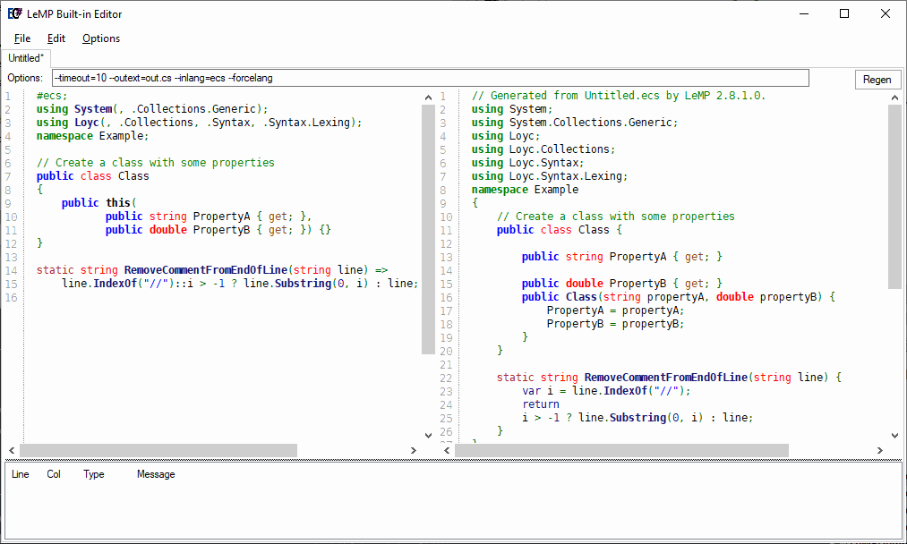

In Visual Studio
----------------

To install LeMP in Visual Studio (2017/2019), download the vsix file from the [latest release page](https://github.com/qwertie/ecsharp/releases), and double-click on it.

**Note:** users should be aware that LeMP has a similar security risk as T4 templates (.tt files, which are natively supported by Visual Studio). LeMP and T4 templates can run any code they are instructed to run inside the file they are processing.

**Note**: If you installed a previous version of LeMP, you must uninstall it from within Visual Studio first; apparently vsix files don't support upgrades. Go to Extensions \| Manage Extensions, find the "LeMP Custom Tool" in the "Installed" section, and click Uninstall. You'll be asked to close Visual Studio. Close all instances. (If your old version is called LoycSyntaxForVS, then you were using the old two-part install process, which means there is also a two-part uninstall process. In this case, the second part of the uninstallation is to find the LoycFileGeneratorForVs.exe file (it is located wherever you chose to put it). Run this file and click "Unregister (Uninstall)".)

### Try it out

I typically add a .cs file to my project as usual, then change the extension to .ecs. The Enhanced C# syntax highlighter should take over, and IntelliSense will stop working. Alternately, you can create a text file and give it the .ecs extension in the first place, as shown here:

Then, open the *Properties* panel and change the *Custom Tool* option to **_LeMP_**. An output file called `example.out.cs` should appear under `example.ecs`.

Finally, add some Enhanced C# code to make sure it works, e.g.

~~~csharp
using System;
using System.Collections.Generic;
using System.Linq;
using System.Windows;

namespace Loyc.Ecs {
   class Person {
      public this(public readonly string Name, 
                  public int WeightLb, public int Age) {}
   }
}
~~~

Most features of LeMP (or [LLLPG](/lllpg)) do not have any runtime dependencies, but a few do. For example:

- [Code Contracts](http://ecsharp.net/lemp/ref-code-contracts.html) can be used with or without the [Microsoft Code Contracts](https://github.com/Microsoft/CodeContracts) extension.
- Symbol literals like `@@Hello` require the `Symbol` type from Loyc.Essentials.dll, which you can find via the NuGet package manager built into Visual Studio. You can also obtain Loyc DLLs from the zip file associated with the [latest release](https://github.com/qwertie/ecsharp/releases). This feature also requires the line `#ecs;` at the top of your file.
- The [`quote`](http://ecsharp.net/lemp/ref-other.html#quote) and [`matchCode`](http://ecsharp.net/lemp/ref-other.html#matchcode) macros require at least Loyc.Syntax.dll (which provides support for [LES](http://loyc.net/les) and [Loyc trees](http://loyc.net/loyc-trees)). Loyc.Syntax uses Loyc.Collections and Loyc.Essentials. You also need Loyc.Ecs.dll if you want to parse C# code or EC# code. Again, you can get these DLLs via NuGet.
- [LLLPG](http://ecsharp.net/lllpg) is typically used with Loyc.Syntax.dll, though it can also be used without external dependencies, [as explained in the LLLPG documentation](http://ecsharp.net/lllpg/5-loyc-libraries.html).

### Support for Visual Studio 2008 through 2015

v2.6.2 is the last version of LeMP to support these old versions of Visual Studio, and the only version that supports all versions from 2008 to 2017. For very esoteric reasons (long story short: blame Microsoft), there is a two-part installation process for older versions of Visual Studio. One part is the Single-File Generator (Custom Tool), and the other is the syntax highlighter.

So, download LeMP2.6.2.zip from its [release page](https://github.com/qwertie/ecsharp/releases/tag/v2.6.2) and unzip it.

Then, run `Lib\LeMP\LoycFileGeneratorForVs.exe` to install the LeMP & LLLPG Custom Tools (a.k.a. Single-File Generators). Make sure your version of Visual Studio is listed, and click Register (install).

**Note**: The custom tools run in-place; they are not copied anywhere else.

To install syntax highlighting for `.ecs` and `.les` files, run `LoycSyntaxForVs.vsix`. This extension supports Visual Studio 2010 through 2015 (not 2008).

On other platforms
------------------

All platforms support a command-line version of LeMP, LeMP.exe, and a demo window, LeMPDemo.exe. Download the zip file from the [latest release](https://github.com/qwertie/ecsharp/releases) (e.g. LeMP2.6.2.zip) and unzip it.

That zip file contains LeMP.exe. You can run this file directly on Windows:

    LeMP your-source-code.ecs

But on other platforms you'll typically run it with [mono](http://www.mono-project.com) or .NET Core, e.g.

    mono ./LeMP.exe your-source-code.ecs

LeMPDemo.exe is a program that lets you try it interactively:

Okay, that's it. Good luck, have fun. If you have questions, please post them on StackOverflow with the `lemp` and `ec#` tags, and I will be notified. If you find a bug or have a feature request, post it on the [issues list](https://github.com/qwertie/ecsharp/issues).